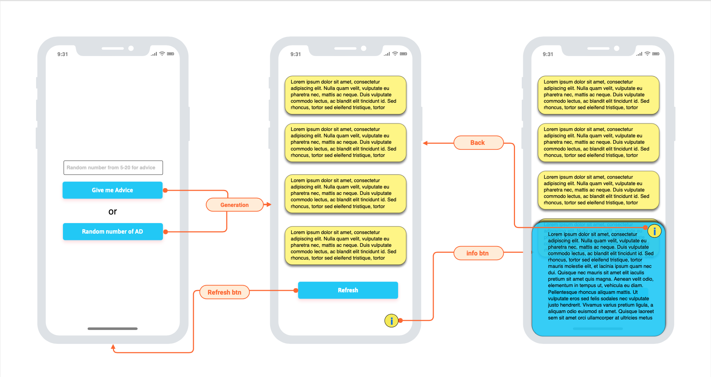
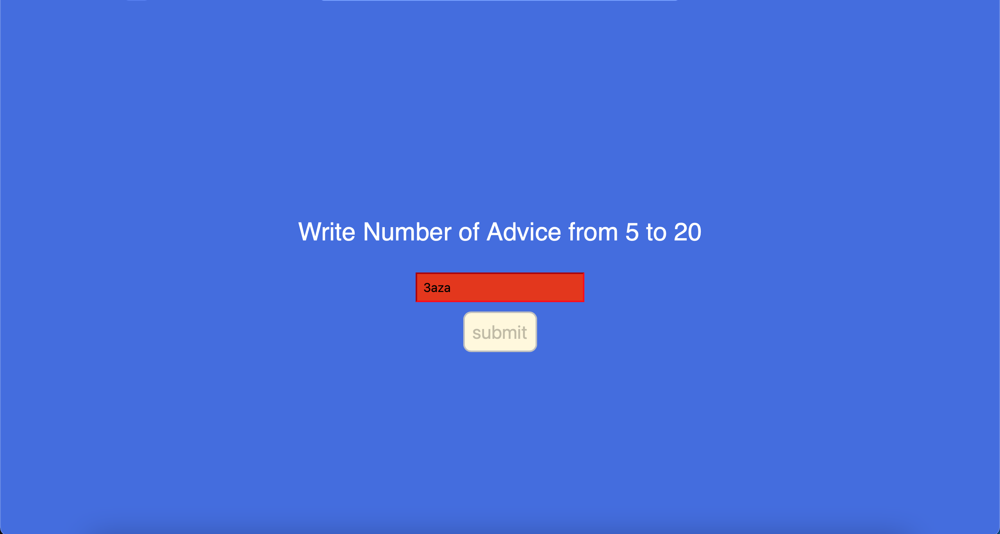
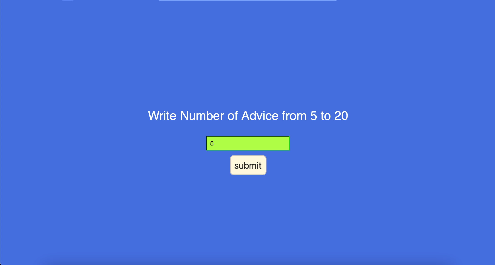
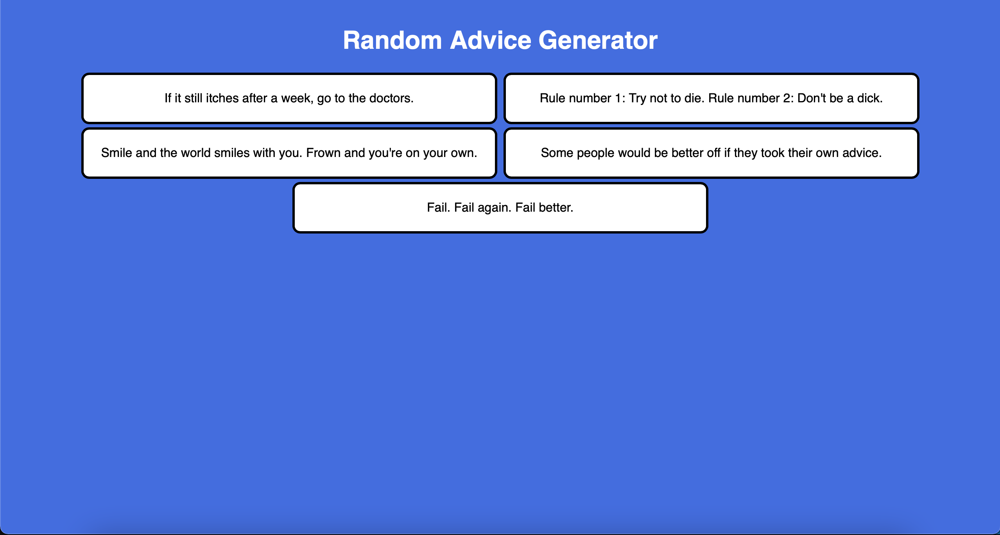

# gMadvice

### Instruction

Open webSite https://github.com/Lutsyk/gMadvice
You can see

Try to write quantity of advices

You can only write numbers '!words don't fit' from 5 to 20

After leaving the input, if you entered valid data, the submit button will be active and you get your advice!!!

### VersionWirhTranslator

firstly - instal npm packege 
concole -> npm install

after run an http server

